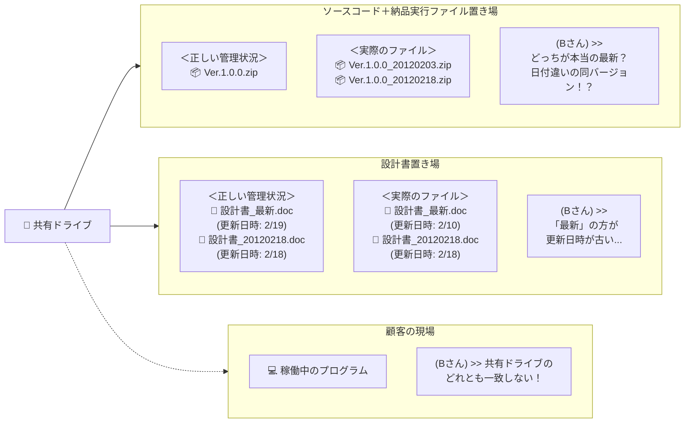
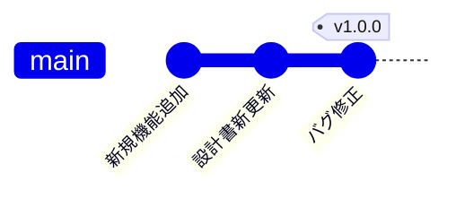
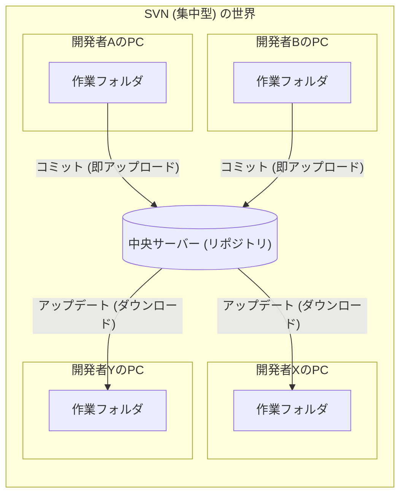
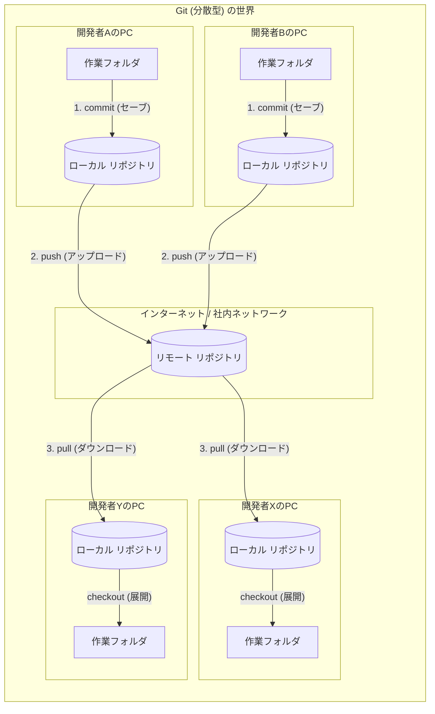
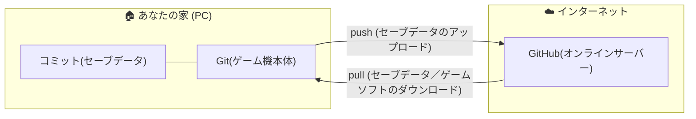
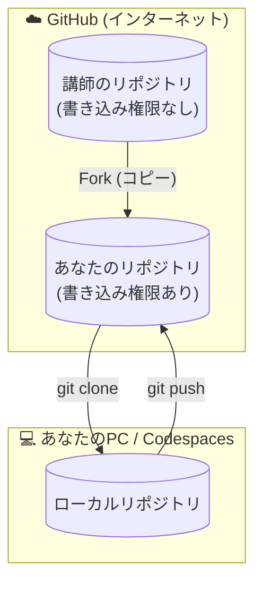

# Gitの歴史と概念：なぜ私たちはGitを使うのか？

## 1. そもそも「ソースコード管理」とは？

皆さんが作成するプログラムのソースコードは、日々変更されていきます。

- 「昨日の状態に戻したい」
- 「いつ、誰が、なぜここを変更したのか知りたい」

と思ったことはありませんか？まだ、ありませんよね？

プログラムを実装しているとそうなるのですが、それを解決するのが **バージョン管理システム（VCS: Version Control System）** です。

単なるバックアップではなく、「変更の歴史」を詳細に記録するツールです。

この VCS で有名なのが Git（ギット） です。

## 2. バージョン管理なき現場の悲劇

「バージョン管理なんて大変なものを使わなくても、フォルダ共有でバックアップすれば十分でしょ？」

そう思うかもしれません。しかし、バージョン管理がない現場では、以下のような恐ろしい事件が実際に起きています。

これは、私が新卒で入った会社（バージョン管理未導入）で実際に体験したトラブルの話です。

### 事件発生：どれが最新かわからない

ある日、先輩Aさんが作ったシステムに不具合が見つかりました。

Aさんは別のプロジェクトに異動していたため、熟練のBさんが修正を引き継ぐことになりました。

Bさんは、共有ドライブにある「納品物フォルダ」を開きました。そこには地獄が広がっていました。

#### 共有ドライブの惨状（イメージ図）

### 3つの絶望ポイント

1. ソースコードのファイル名が信用できない: Ver.1.0.0 と書かれたファイルが複数あり、日付もバラバラ。本来は１つだけのはず。
1. 「最新」詐欺: 設計書_最新.doc というファイルより、日付付きファイルの方が更新日時が新しい。（どちらの日付のソースコードが正しいか仕様書の変更点から判断できない）
1. 現物が迷子: お客様のところで動いているプログラムが、手元のどのZIPとも一致しない。（実行ファイルや設定ファイルから最新のソースコードを特定できない）

### 結末：人海戦術と勘

結局、Bさんは設計書もソースコードも信用できず、現場の保守担当者の「記憶」と「勘」を頼りにソースコードを特定しました。

その後、恐る恐る修正を行い、膨大な時間と精神疲労をかけてテストをして、なんとか難を逃れました。

もしあの時、バージョン管理があったら...。Bさんの苦労は一瞬で解決していたはずです。このコスト本当に払う必要性ありましたか？

### バージョン管理で解決しよう

このトラブルは、バージョン管理の基本機能があれば全て防げました。

| トラブル | バージョン管理の用語 | 解説 |
| --- | --- | --- |
| 「どれが最新かわからない」 | Commit Log (コミットログ) | 「いつ、誰が、どの順番で保存したか」が一直線の歴史として残ります。ファイル名で管理する必要はありません。 |
| 「お客様の環境と一致しない」 | Commit ID (コミットID) | お客様の環境には a1b2c3d のようなIDを記録しておきます。そのIDに戻れば、1bitの狂いもなく当時のソースコードが復元されます。 |
| 「Ver1.0.0が複数ある」 | Tag (タグ) | 特定のコミットに「v1.0.0」という動かない名札を貼り付けます。後から勝手に増えたりしません。 |
| 「設計書が信用できない」 | Repository (リポジトリ) | プログラムだけでなく、設計書もバージョン管理で管理すれば、ソースコードと同じ歴史の中で管理できます。 |

### バージョン管理導入後の世界（イメージ図）

- ファイル名に日付をつけた管理は不要！
- リリースしたときに **v1.0.0** と登録しておけば、後から誰でも現地と一致するソースコードを完璧に復元

1年後に内容を詳細に覚えているとは限りません。

特にチームに入ったばかりの新人であれば **言われたとおりに対応した** 程度になりがちで、後から間違いを修正する際に大きなトラブルになります。

バージョン管理を学ぶということは、単にツールの使い方を覚えるだけでなく、「**過去の自分やチームメンバーを助けるための保険**」 をかけるということなのです。

---

## 3. Git誕生の物語：Linuxカーネル開発の課題

Gitは、世界でも有名なOSである「Linux」の開発現場から生まれました。

出典：[Pro Git: 1.2 Git略史](https://git-scm.com/book/ja/v2/%e4%bd%bf%e3%81%84%e5%a7%8b%e3%82%81%e3%82%8b-Git%e7%95%a5%e5%8f%b2)

### 課題：数千人規模の同時開発

1991年から始まったLinuxの開発には、世界中のハッカーが参加していました。

当初はパッチ（修正差分）をメールで送り合うというアナログな方法や、商用の管理ツール（BitKeeper）を使っていました。

### 事件：ツールの使用禁止

2005年、開発チームとツール提供元の対立により、Linux開発チームはそれまで使っていた管理ツールを無料で使えなくなってしまいました。

### 解決：「気に入らないなら自分で作る」

Linuxの生みの親である **リーナス・トーバルズ (Linus Torvalds)** さんは、既存の他のツール（`Subversion`など）への不満を爆発させました。

> 「既存のツールはどれも遅くて、分散開発に向いていない。僕が考える最強のツールを作る」

彼は **わずか2週間ほど** で新しいツールのプロトタイプを作り上げました。それが **Git** です。

彼が重視したのは以下の点でした。

1. **爆速であること**（数万ファイルの巨大プロジェクトでも一瞬で動く）
2. **分散型であること**（ネットワークが切れていても作業できる）
3. **データが壊れないこと**（過去の履歴を改ざんさせない）

---

## 4. 「集中型」と「分散型」の違い

なぜGitが革新的だったのか、それ以前の主流だった **Subversion (SVN)** と比較してみましょう。

現場によってはまだSVNが現役の場所もあるため、違いを知っておくことは重要です。

### SVN（集中型バージョン管理）

- **特徴:** 中央に一つの「正解（リポジトリ）」がある。
- **弱点:**
  - サーバーと通信できないと、履歴の保存（コミット）ができない。
  - サーバーが故障すると、全員の仕事が止まる。
  - 「全員がサーバー上の同じファイルを触る」感覚に近い。

### Git（分散型バージョン管理）

- **特徴:** 全員が手元（ローカル）に「完全な正解（リポジトリ）」のコピーを持っている。
- **強み:**
  - オフラインでも履歴の保存（コミット）ができる。
  - 自分の手元でいくら実験して壊しても、サーバー（リモート）には影響しない。
  - **「コミット（記録）」と「プッシュ（共有）」が明確に分かれている。**

### アーキテクチャ図解

以下の図を見て、データの流れの違いをイメージしてください。

## 5. 「Git」と「GitHub」の違い

初心者が一番混乱するのが「Git」と「GitHub」の関係です。

名前は似ていますが、全く別物です。

皆さんが馴染みのある **「ゲーム」** に例えると、その違いがハッキリ分かります。

### Git（ギット）＝「ゲーム機本体と本体に保存したセーブデータ」

- **役割:** あなたの手元（ローカル）で動く **ツール（道具）** 。

- **状態:** インターネットがなくても動きます。
- **できること:**
  - 一人で開発（ゲームプレイ）を進める。
  - こまめに記録する（セーブポイントを作る）。
  - 失敗したら、前のセーブポイントからやり直す。

- **Gitは単体で動作します。** 自分一人で開発するだけなら、GitHubは必須ではありません。

### GitHub（ギットハブ）＝「オンラインサーバーとインターネットに保存したセーブデータ」

- **役割:** みんなのセーブデータを持ち寄る **Webサービス（場所）** 。

- **状態:** インターネット上にあります。
- **できること:**
  - 新しいゲームソフト本体の購入とダウンロードする。
  - 自分のセーブデータをアップロードしてバックアップする。
  - 友達のセーブデータをダウンロードして続きをやる。
  - チームで協力プレイをする。

- **GitHubはGitがないと使えません。** オンラインサーバーだけあっても、ゲーム機がないと遊べないのと同じです。

### 図解イメージ

### 6. GitHub以外の選択肢（類似サービス）

Gitのデータを保存する場所（ホスティングサービス）は、GitHub以外にも存在します。

SESの現場では、**「利用しているクラウド（AWSやAzureなど）に合わせて、Gitの場所も決める」** ことが多いため、以下の名前も覚えておきましょう。

#### イントラネットワーク・SaaS型

- **GitLab (ギットラボ):** 自社サーバーにインストールして使えるため、セキュリティ重視の現場で人気です。
- **Bitbucket (ビットバケット):** Jiraなどの管理ツールと同じ会社が提供しており、連携に強いです。
- **Backlog (バックログ):** 日本の会社が提供。プロジェクト管理機能の一部としてGit機能があります。

#### クラウドベンダー提供型（クラウド環境とセットで使う）

- **Azure DevOps (アジュール デブオプス):** Microsoft (Azure) の開発プラットフォームです。
- **AWS CodeCommit (コードコミット):** Amazon Web Services (AWS) 上のリポジトリサービスです。
- **OCI DevOps (オーシーアイ デブオプス):** Oracle Cloud Infrastructure (OCI) 上のリポジトリサービスです。

**重要:** どのサービスを使っていても、 **「Gitコマンド」としては同じ** です。

「プッシュ先（URL）」が変わるだけで、Git操作としては、やることは変わりません。GitHubで基本を覚えれば、どこに行っても通用します。

Githubとそれ以外のサービスの違いがあるとすれば、次の２つです。

- 認証の仕方（[# 【資料】ローカル環境での認証設定](../99_reference/authentication.md) ）は異なりますので、サービスごとに調べるようにしてください。
- Pull Request、Project、issue などの追加機能

---

## 7. 【コラム】Fork（フォーク）とは？

学習を始める際、右上のボタンから **「Fork」** をしましたよね？

これについても理解しておきましょう。

### Clone（クローン）との違い

よく混同されますが、コピーされる「場所」が違います。

- **Fork:** GitHubのサーバーの中で、他人のリポジトリを自分のアカウントにコピーすること。
- **Clone:** GitHubのリポジトリを、自分のパソコン（ローカル）にダウンロードすること。

### 図解

今回のハンズオン環境は、以下のような流れで作られました。

#### なぜForkするの？

他人のリポジトリ（OSSなど）に貢献したい時、いきなり他人のリポジトリに `git push` することはできません（権限がないからです）。

そのため、一度 `Fork`して「自分の持ち物」にしてから、自由に開発を進めるのです。

他人のリポジトリを編集するのも、コミットするのも、プッシュするのも、それだけ聞くと怖くてできないと思いますが、フォーク済みのリポジトリはあなたのリポジトリになっています。

フォーク元のリポジトリに反映するには、プルリクエストを送信する必要があります。

安心して、Git学習を進めてください。

---

## この学習のゴール

ここでは、この後、Gitを使って以下のことができる状態を目指します。

1. 自分のPC内で安全に履歴の保存を行う (commit)
1. 自分の領域を作って、本番リリース済みの結果を壊さずに機能を試す (branch)
1. チームメンバーと変更を共有・統合する (push / merge)
1. 過去の変更を取り消したり、事故から復旧する (revert / fix)

次は、実際に自分の専用環境（`Codespaces`）で、Gitの初期設定を行っていきましょう。

## 完了したら

[01. 一人で進める開発の基本：セーブデータを記録しよう](/01_local_basic/README.md) へ進みます。
