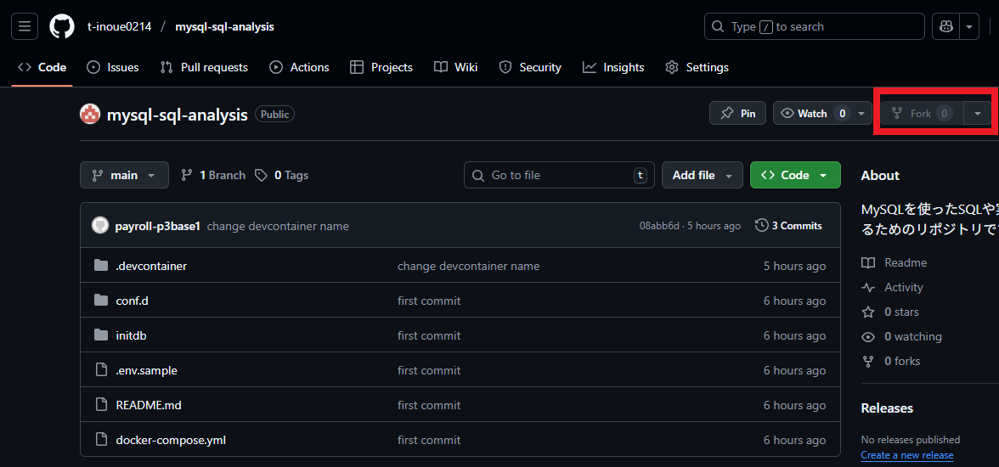
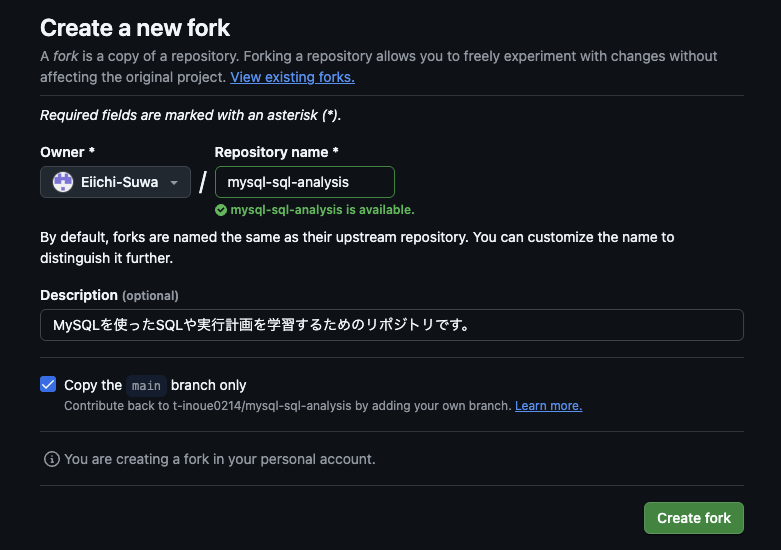
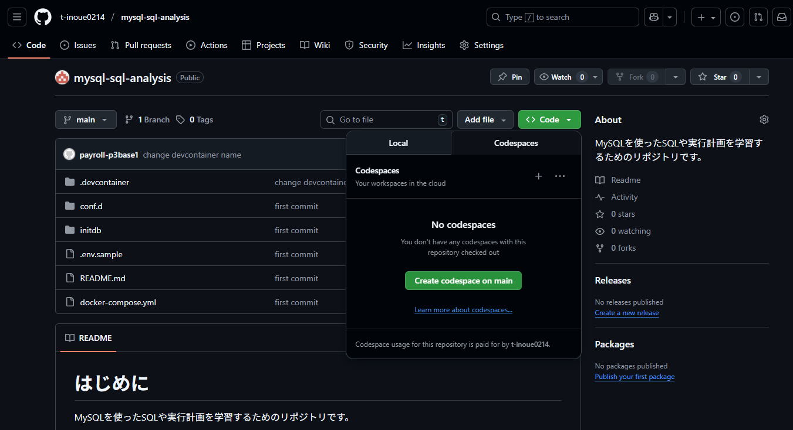
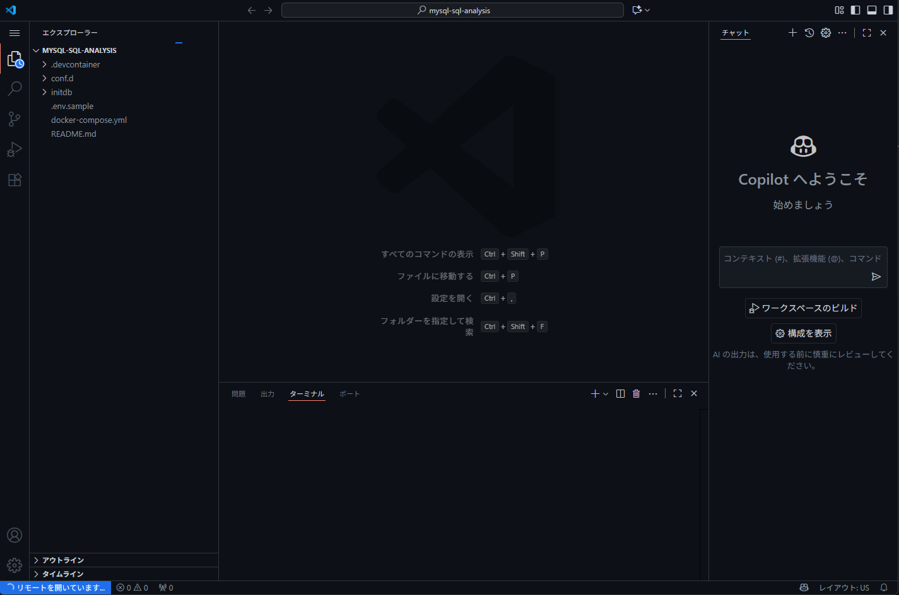

# starter-git-with-github

このリポジトリは、開発現場で必須となる **Git（ソースコード管理）** の概念と操作を、実際に手を動かしながら学ぶためのハンズオン資料です。

Gitについては、[Git book](https://git-scm.com/book/ja/v2) を参照してもらうほうが正確だと思いますが、初学者からすると、どこを読めばいいのか分かりづらい可能性があるため、ある程度抜粋したものになります。

いつもGUIで操作している人も、せっかくですからコマンドラインで操作して、Gitについて詳しくなってもらえればと思います。

## 前提条件

- GitHubのアカウントを持っていること

## 学習の始め方（環境構築）

この勉強会では **GitHub Codespaces** を使用します。

面倒な環境構築は不要です。ブラウザさえあれば、すぐに学習を始められます。

1. このリポジトリをフォークするため、右上の`fork`をクリックする

    

1. `Create fork`ボタンをクリックして、フォーク（自分のアカウントにコピーして新しいリポジトリを作成）します。

    

1. `Codespace`を起動するため、`Code`タブに移動し、右上にある緑色の`code`のプルダウンメニューを開き、`Codespace`タブを開き、`Create codespace on main`をクリックします。

    

1. `Codespace`の生成にはしばらく時間がかかるため、しばらく待ちます。

    

1. `VSCode`が起動しますが、画面左下が`リモートを開いています...`の間は待ちます。

    

1. 画面左下が`Codespace`になった場合は、`Codespace`が起動完了しました

    

環境が立ち上がったら、左側のファイル一覧から学習したい章のフォルダを開いてください。

## Codespaces利用上の注意

- `Github`の`Codespaces`を利用します。`Codespaces`は設定によってはコストがかかるものなので [Codespace の利用上の注意](./CODE_SPACES_SERICE.md) はよく確認してください。
- コストをかけないためにも、セキュリティの意味でも、使い終わったら [停止方法](./CODE_SPACES_SERICE.md#3-停止方法) に従って停止することを推奨します。

## カリキュラム

上から順番に進めてください。

### [00. 歴史と概念：なぜ私たちはGitを使うのか？](./00_history_and_concept/README.md)

- なぜファイルをコピーしてバックアップしてはいけないのか？
- Gitが生まれた歴史的背景（Linux開発）
- SVN（集中型）と Git（分散型）の違い

### [01. 一人で進める開発の基本：セーブデータを記録しよう](./01_local_basic/README.md)

- 自分のPC内での基本サイクル
- `git add`, `git commit`
- 歴史の確認方法

### [02. 平行世界を作る：ブランチとマージ](./02_branch_and_merge/README.md)

- 本番環境を壊さずに実験する方法
- `git checkout -b`
- `git merge` と歴史の合流

### [03. チーム開発のルール：ワークフローとリモート連携](./03_workflows/README.md)

- 自分のPC（ローカル）とサーバー（リモート）の連携
- 現場による文化の違い（GitHub Flow vs Git Flow）
- `git push`, `git pull`

### [04. 失敗と修正：リカバリの作法と禁忌](./04_fix_and_recovery/README.md)

- コンフリクト（衝突）の解消方法
- やっていい修正（`revert`, `amend`）
- **絶対にやってはいけない操作**（`push -f` の危険性）

### [05. 現場で役立つ便利機能](./05_useful_tips/README.md)

- ゴミを除外する `.gitignore`
- 作業を一時退避する `git stash`
- レビュー修正時のプルリク更新方法

## 資料

### [ローカルPCでの認証設定手順 (Windows/Mac)](./99_reference/authentication.md)

- 自分のPCからGitHubにPushするための設定方法（トークン / SSH）です。

## この教材の進め方

本教材では、特定の便利な拡張機能（GUIツール）には頼りません。

**「コマンド操作 (CLI)」** を中心に学習します。

なぜなら、現場によっては便利なツールが禁止されていたり、黒い画面（ターミナル）しか使えないサーバー上で作業を求められることがあるからです。

どこでも通用するスキルを身につけましょう。

### 学習の基本サイクル

1. **説明を読む:** 各章の `README.md` を読みます。
2. **コマンドを打つ:** ターミナルで実際にコマンドを実行します。
3. **確認する:** 以下のコマンドで、歴史が正しく作られているか確認します。

    ```bash
    git log --oneline --graph --all
    ```

資料の中に Mermaid（フロー図） で正解の形が描かれています。 ターミナルに表示されたグラフが、資料の図と同じ形になっていれば成功です。

## 次のステップ

まずは [00. 歴史と概念：なぜ私たちはGitを使うのか？](/00_history_and_concept/README.md) へ進みます。
